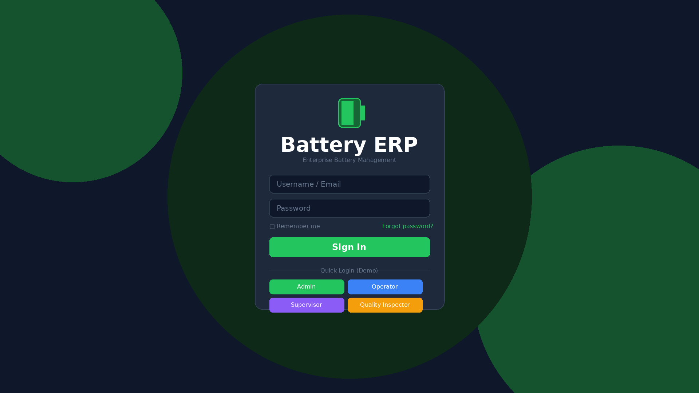
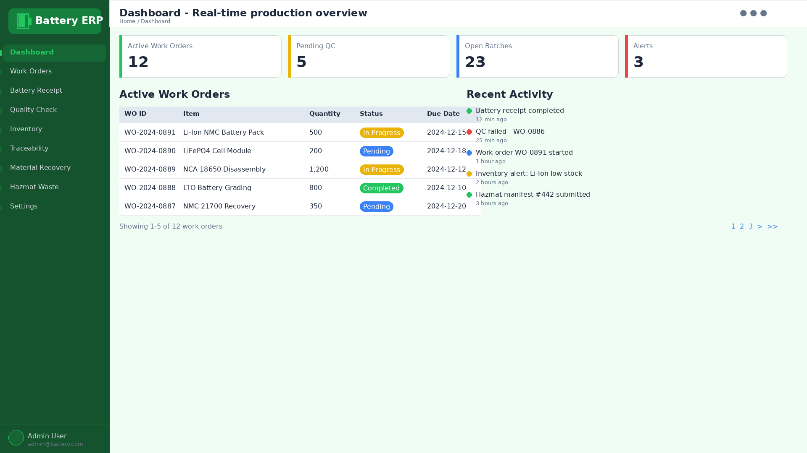
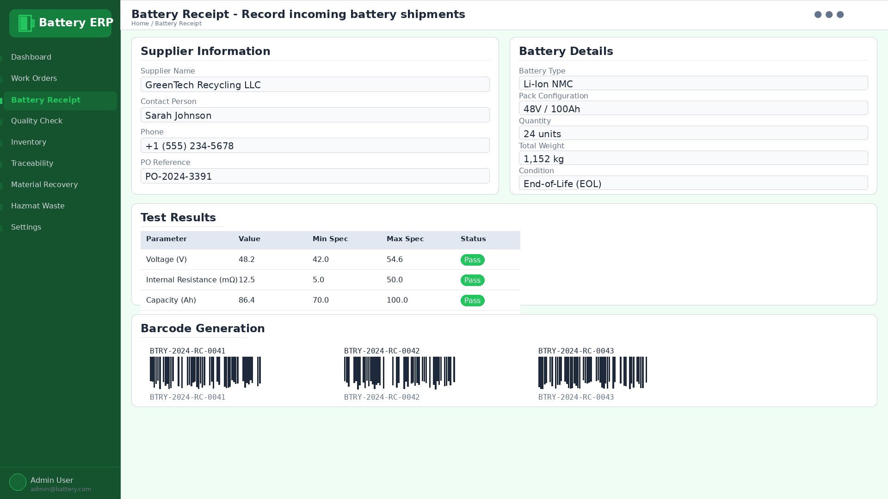
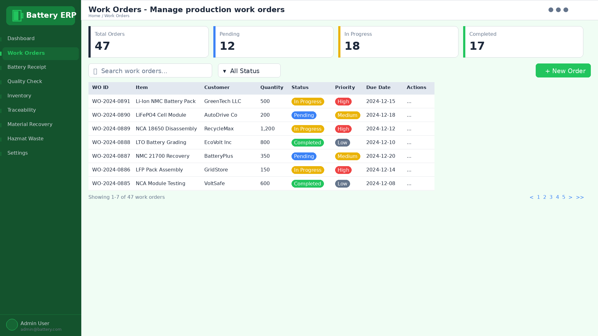
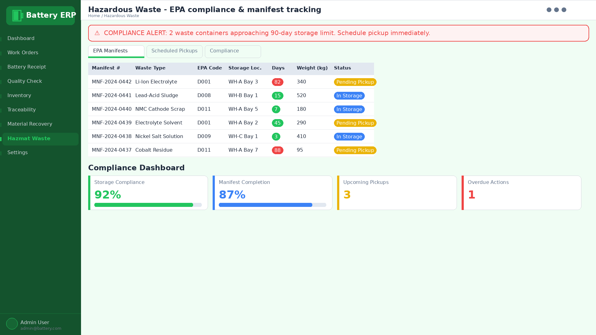
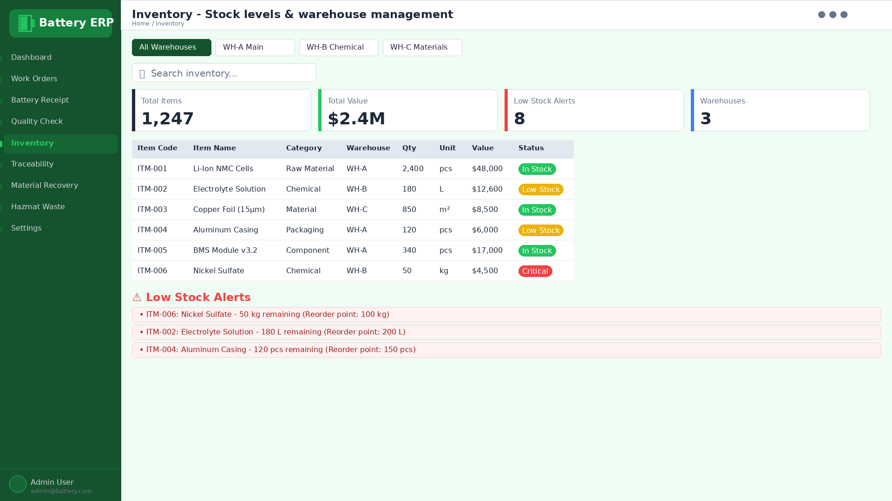
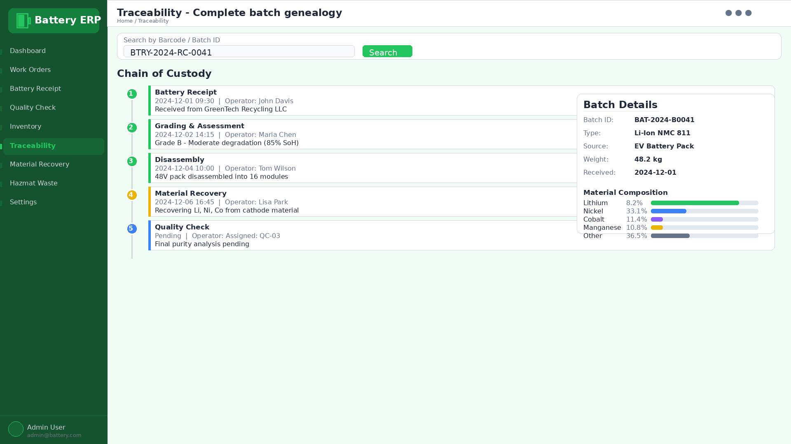

# 🔋 Battery ERP

**A comprehensive ERP system for battery recycling operations**


[](./DEPLOYMENT.md)
[](./docs/)
[](./docs/API.md)

---

## 📋 Table of Contents

- [Overview](#overview)
- [Features](#features)
- [Architecture](#architecture)
- [Quick Start](#quick-start)
- [Demo](#demo)
- [Screenshots](#screenshots)
- [Integrations](#integrations)
- [Attribution](#attribution)
- [License](#license)

---

## 🎯 Overview

Battery ERP is a production-ready enterprise resource planning system designed specifically for **battery recycling operations**. It combines manufacturing execution, quality management, traceability, and compliance tracking into a unified platform.

### Built With

- **Frontend**: React 18, TypeScript, TailwindCSS
- **Backend**: Node.js, Express
- **Database**: Astra DB (Cassandra), MariaDB, PostgreSQL
- **Authentication**: JWT with RBAC
- **Integrations**: ERPNext, Carbon, Xero, Precoro

---

## ✨ Features

### 🔐 Security & Authentication
- ✅ JWT-based authentication with 8-hour sessions
- ✅ Role-based access control (RBAC)
- ✅ 4 default roles: Admin, Supervisor, Operator, Quality Inspector
- ✅ Protected routes and API endpoints
- ✅ Rate limiting and brute force protection
- ✅ Security headers (Helmet.js)
- ✅ XSS and CSRF protection

### 📦 Manufacturing Operations
- ✅ Work order management
- ✅ Production tracking
- ✅ Material requirements planning (MRP)
- ✅ Shop floor interface (tablet-optimized)
- ✅ Real-time production dashboard

### ♻️ Battery Recycling
- ✅ Battery receipt and grading
- ✅ Inbound processing workflows
- ✅ Disassembly tracking
- ✅ Material recovery tracking
- ✅ Recovery rate calculations
- ✅ Mass balance tracking

### 🏷️ Barcode & Traceability
- ✅ QR code and Code 128 barcode generation
- ✅ Camera-based barcode scanning
- ✅ USB barcode scanner support
- ✅ Label printing (3 sizes)
- ✅ Full batch genealogy
- ✅ Chain of custody tracking

### ⚠️ Hazardous Waste Compliance
- ✅ EPA manifest tracking
- ✅ 90-day accumulation monitoring (LQG)
- ✅ 180-day accumulation monitoring (SQG)
- ✅ Compliance alerts and reporting
- ✅ Waste vendor management
- ✅ Storage location tracking

### 📊 Inventory Management
- ✅ Multi-warehouse support
- ✅ Real-time stock levels
- ✅ Stock transfers
- ✅ Low stock alerts
- ✅ Reorder point tracking
- ✅ Inventory valuation

### 🔬 Quality Management
- ✅ Quality inspection plans
- ✅ In-process inspections
- ✅ Final product testing
- ✅ Non-conformance tracking
- ✅ Certificate of analysis

### 🔗 External Integrations
- ✅ **ERPNext**: Full business operations sync
- ✅ **Carbon**: Manufacturing execution sync
- ✅ **Xero**: Accounting integration
- ✅ **Precoro**: Procurement automation
- ✅ **Astra DB**: Time-series data & analytics

---

## 🏗️ Architecture

```
┌─────────────────────────────────────────────────────────────────┐
│                      User Interfaces                             │
│  ┌─────────────┐  ┌─────────────┐  ┌─────────────────────────┐ │
│  │  Shop Floor │  │   Admin     │  │      Mobile (PWA)       │ │
│  │   Tablet    │  │  Dashboard  │  │                         │ │
│  └─────────────┘  └─────────────┘  └─────────────────────────┘ │
├─────────────────────────────────────────────────────────────────┤
│                    API Gateway (Node.js)                         │
│  ┌──────────────────────────────────────────────────────────┐  │
│  │  Security Layer: Auth, Rate Limit, CORS, XSS Protection  │  │
│  └──────────────────────────────────────────────────────────┘  │
│  ┌─────────┐ ┌─────────┐ ┌─────────┐ ┌─────────┐ ┌─────────┐ │
│  │  Auth   │ │ Barcode │ │ HazMat  │ │Inventory│ │  Sync   │ │
│  │ Service │ │ Service │ │ Service │ │ Service │ │ Service │ │
│  └─────────┘ └─────────┘ └─────────┘ └─────────┘ └─────────┘ │
├─────────────────────────────────────────────────────────────────┤
│                      Data Layer                                  │
│  ┌──────────────┐  ┌──────────────┐  ┌──────────────────────┐ │
│  │   Astra DB   │  │   MariaDB    │  │    PostgreSQL        │ │
│  │  (Time-series│  │  (ERPNext)   │  │     (Carbon)         │ │
│  │   Analytics) │  │              │  │                      │ │
│  └──────────────┘  └──────────────┘  └──────────────────────┘ │
├─────────────────────────────────────────────────────────────────┤
│                   External Systems                               │
│  ┌──────────┐  ┌──────────┐  ┌──────────┐  ┌──────────────┐  │
│  │  Xero    │  │ Precoro  │  │  Banks   │  │  Logistics   │  │
│  └──────────┘  └──────────┘  └──────────┘  └──────────────┘  │
└─────────────────────────────────────────────────────────────────┘
```

---

## 🚀 Quick Start

### Prerequisites

- Node.js 18+
- Docker & Docker Compose
- Astra DB account (free tier available)
- ERPNext instance (optional)
- Carbon instance (optional)

### Installation

```bash
# Clone the repository
git clone https://github.com/YOUR_USERNAME/battery-erp.git
cd battery-erp

# Copy environment file
cp .env.example .env

# Edit .env with your credentials
# Required: JWT_SECRET, ASTRA_TOKEN, ASTRA_CLIENT_ID

# Install dependencies
cd integrations && npm install
cd ../shop-floor && npm install

# Start services
# Terminal 1: Integration API
cd integrations
npm run dev

# Terminal 2: Shop Floor UI
cd shop-floor
npm run dev
```

### Access

| Service | URL | Credentials |
|---------|-----|-------------|
| Shop Floor UI | http://localhost:3002 | admin / admin123 |
| Integration API | http://localhost:3001 | API key required |
| Grafana Dashboard | http://localhost:3100 | admin / admin |

### Default Users

| Username | Password | Role | Permissions |
|----------|----------|------|-------------|
| `admin` | `admin123` | Admin | Full access |
| `supervisor` | `supervisor123` | Supervisor | Full access |
| `operator` | `operator123` | Operator | Production operations |
| `quality` | `quality123` | Quality Inspector | Quality & traceability |

⚠️ **Change default passwords immediately in production!**

---

## 🎬 Demo

### 3-Minute Product Tour

[](https://www.youtube.com/watch?v=Z4op7sMSbXw)


> **YouTube Demo:** https://www.youtube.com/watch?v=Z4op7sMSbXw
**Demo Timeline:**
- 0:00 - Login & Dashboard
- 0:30 - Battery Receipt with Barcode Scanning
- 1:00 - Work Order Management
- 1:30 - Quality Inspection
- 2:00 - Material Recovery Tracking
- 2:30 - Hazardous Waste Compliance

### Interactive Demo

Try our live demo (read-only):
```bash
# Demo credentials
Username: demo
Password: demo123
```

---

## 📸 Screenshots

### Login Screen

*Secure JWT authentication with role-based access*

### Dashboard

*Real-time production overview with key metrics*

### Battery Receipt with Barcode Scanning

*Camera-based barcode scanning for inbound batteries*

### Work Order Management

*Production work orders with status tracking*

### Hazardous Waste Tracking

*EPA compliance with 90-day accumulation alerts*

### Inventory Management

*Multi-warehouse stock levels and transfers*

### Traceability Chain

*Complete batch genealogy from receipt to recovery*

---

## 🔗 Integrations

### ERPNext Integration

Battery ERP integrates with [ERPNext](https://erpnext.com) for business operations:

- **Sync Direction**: Bi-directional
- **Data Types**: Work Orders, Stock Entries, Quality Inspections
- **Frequency**: Real-time (5-second intervals)

```bash
# Configure ERPNext connection
ERPNext_URL=https://your-erpnext.com
ERPNext_API_KEY=your-api-key
ERPNext_API_SECRET=your-api-secret
```

**Attribution:**
- ERPNext is © [Frappe Technologies](https://frappe.io)
- Licensed under [GPL-3.0](https://www.gnu.org/licenses/gpl-3.0.html)
- ERPNext is a trademark of Frappe Technologies

### Carbon Integration

Battery ERP integrates with [Carbon](https://github.com/crbnos/carbon) for manufacturing execution:

- **Sync Direction**: Bi-directional
- **Data Types**: Production Orders, Material Consumption, Quality Data
- **Frequency**: Real-time

```bash
# Configure Carbon connection
CARBON_URL=https://your-carbon.com
CARBON_API_KEY=your-api-key
```

**Attribution:**
- Carbon is © [Carbon Contributors](https://github.com/crbnos/carbon)
- Licensed under [MIT License](https://github.com/crbnos/carbon/blob/main/LICENSE)
- Carbon is a project by crbnos and contributors

### Xero Integration

- **Sync Direction**: Bi-directional
- **Data Types**: Invoices, Bills, Payments, Contacts
- **Frequency**: Real-time

### Precoro Integration

- **Sync Direction**: Bi-directional
- **Data Types**: Purchase Orders, Shipments, Vendors
- **Frequency**: Real-time

---

## 📄 Attribution

This project builds upon and integrates with several excellent open-source projects:

### Primary Dependencies

| Project | License | Attribution |
|---------|---------|-------------|
| [ERPNext](https://github.com/frappe/erpnext) | GPL-3.0 | © Frappe Technologies |
| [Carbon](https://github.com/crbnos/carbon) | MIT | © Carbon Contributors |
| [React](https://github.com/facebook/react) | MIT | © Meta Platforms, Inc. |
| [Express](https://github.com/expressjs/express) | MIT | © TJ Holowaychuk |
| [Astra DB](https://www.datastax.com/products/datastax-astra) | Apache-2.0 | © DataStax, Inc. |

### Additional Libraries

- **Authentication**: jsonwebtoken (MIT), bcryptjs (MIT)
- **UI Components**: @heroicons/react (MIT), TailwindCSS (MIT)
- **Barcode**: html5-qrcode (Apache-2.0), react-barcode (MIT)
- **Data**: cassandra-driver (Apache-2.0), @datastax/astra-db-ts (MIT)
- **Security**: helmet (MIT), express-rate-limit (MIT), xss-clean (MIT)

### Licenses

- **Battery ERP Core**: AGPL-3.0
- **Integration Layer**: AGPL-3.0
- **Shop Floor UI**: AGPL-3.0
- **Documentation**: CC-BY-SA-4.0

See [LICENSE](./LICENSE) and [NOTICE](./NOTICE) for full license information.

---

## 🔒 Security

### Security Features

- ✅ JWT authentication with configurable expiry
- ✅ Role-based access control (RBAC)
- ✅ Rate limiting (100 req/15min general, 10 req/hr auth)
- ✅ CORS configuration
- ✅ Helmet.js security headers
- ✅ XSS protection
- ✅ CSRF protection
- ✅ Input validation and sanitization
- ✅ Security audit logging
- ✅ IP blocking capability

### Security Best Practices

1. **Change default passwords immediately**
2. **Use strong JWT secrets** (64+ characters)
3. **Enable HTTPS/TLS in production**
4. **Configure CORS for your domain**
5. **Rotate API keys regularly**
6. **Enable audit logging**
7. **Set up intrusion detection**
8. **Regular security updates**

### Reporting Vulnerabilities

Please report security vulnerabilities to: security@battery-recycling.com

---

## 📖 Documentation

| Document | Description |
|----------|-------------|
| [README.md](./README.md) | This file - overview and quick start |
| [DEPLOYMENT.md](./DEPLOYMENT.md) | Production deployment guide |
| [ARCHITECTURE.md](./docs/ARCHITECTURE.md) | System architecture details |
| [API.md](./docs/API.md) | API endpoint reference |
| [SECURITY.md](./SECURITY.md) | Security policies and procedures |
| [CONTRIBUTING.md](./CONTRIBUTING.md) | Contribution guidelines |
| [CHANGELOG.md](./CHANGELOG.md) | Version history |

---

## 🤝 Contributing

We welcome contributions! Please see our [Contributing Guide](./CONTRIBUTING.md) for details.

### Development Setup

```bash
# Fork and clone
git fork https://github.com/YOUR_USERNAME/battery-erp
git clone https://github.com/YOUR_USERNAME/battery-erp.git

# Create branch
git checkout -b feature/your-feature

# Make changes and commit
git commit -m "feat: add your feature"

# Push and create PR
git push origin feature/your-feature
```

### Code Style

- **Backend**: ESLint + Prettier
- **Frontend**: ESLint + Prettier + TypeScript
- **Commits**: Conventional Commits specification

---

## 📊 System Requirements

### Minimum Requirements

- **CPU**: 4 cores
- **RAM**: 8 GB
- **Storage**: 50 GB SSD
- **Network**: 100 Mbps

### Recommended Requirements

- **CPU**: 8 cores
- **RAM**: 16 GB
- **Storage**: 200 GB SSD
- **Network**: 1 Gbps

---

## 🗺️ Roadmap

### Q2 2026 (Current Sprint)
- [x] Mobile app (React Native) - **In Progress**
- [x] Offline mode with sync
- [x] Push notifications

### Q3 2026
- [ ] Advanced analytics dashboards
- [ ] Predictive maintenance
- [ ] Machine learning for quality prediction

### Q4 2026
- [ ] IoT sensor integration
- [ ] EDI for supplier communications
- [ ] Multi-language support (i18n)

---

## 📞 Support

- **Documentation**: https://docs.battery-erp.com
- **Issues**: https://github.com/icohangar-ops/battery-erp/issues
- **Discussions**: https://github.com/icohangar-ops/battery-erp/discussions
- **Email**: sam@cubiczan.com

---

## 📜 License

Battery ERP is licensed under the **GNU Affero General Public License v3.0 (AGPL-3.0)**.

See [LICENSE](./LICENSE) for the full license text.

**Note:** This license ensures that any modifications to this software must also be made available under the same license.

---

## 🙏 Acknowledgments

- **Frappe Technologies** for ERPNext
- **Carbon Contributors** for the Carbon MES platform
- **DataStax** for Astra DB
- **All open-source contributors** whose libraries make this possible

---

<div align="center">

**Built with ❤️ for sustainable battery recycling**

[⭐ Star this repo](../../stargazers) | [🍴 Fork](../../fork) | [📢 Share](../../network/members)

</div>

---

## CHP Governance

This repository is hardened with the [Consensus Hardening Protocol (CHP)](https://codeberg.org/cubiczan/consensus-hardening-protocol), Cubiczan's decision-governance layer for multi-agent AI systems.

### Protocol Layers
- **R0 Gate**: All decisions must pass Solvable, Scoped, Valid, Worth_it checks
- **Foundation Disclosure**: 1-3 weakest assumptions, 1-2 invalidation conditions, 1 key vulnerability
- **Adversarial Layer**: Mandatory devil's advocate at Phase 0 and Round 3
- **State Machine**: EXPLORING → PROVISIONAL → PROVISIONAL_LOCK → LOCKED
- **Third-Party Validation**: Independent CONFIRM/REJECT before lock

### Domain Configuration
- **Category**: Mining / Supply Chain
- **Foundation Threshold**: 75
- **CFO Accuracy Guard**: Disabled

### Compliance Artifacts
| File | Purpose |
|------|---------|
| `.chp/STATE_MACHINE.md` | Decision state transitions |
| `.chp/R0_CONFIG.yaml` | Domain-calibrated thresholds |
| `.chp/ADVERSARIAL_PROMPTS.md` | Standardized challenge templates |
| `.chp/CHP_COMPLIANCE.md` | Compliance tracking & audit trail |

### CHP Version
cognitive-mesh-orchestrator 0.1.0 | [Protocol Docs](https://codeberg.org/cubiczan/consensus-hardening-protocol)

