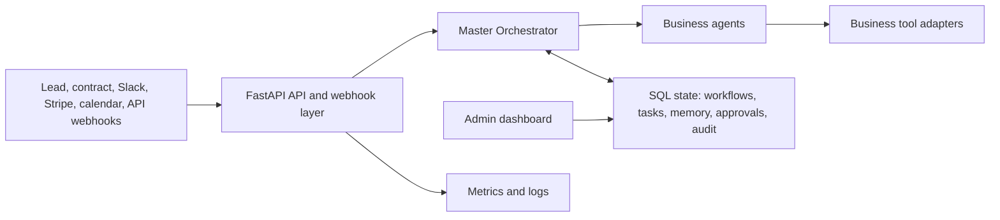

# Architecture

## System Overview

The Autonomous Business Operating System is a FastAPI service with durable SQL state,
background scheduling, external integration adapters, and operator-facing admin controls.

## Agents

- Lead Qualification Agent: ingests leads, enriches via Apollo/Hunter, scores, drafts
  outreach, and syncs the CRM.
- Client Onboarding Agent: starts onboarding after contract signing, creates a project plan,
  schedules kickoff meetings, creates tasks, and notifies Slack.
- Delivery Monitoring Agent: monitors milestone, budget, and communication signals,
  drafts status updates, and escalates delivery risks.
- Finance Operations Agent: creates invoices, checks overdue invoices, reconciles
  payments, and prepares weekly finance summaries.
- Knowledge & Communication Agent: stores internal knowledge, answers Slack queries with
  retrieval over shared memory, and summarizes meeting transcripts into actions.
- Master Orchestrator: dispatches workflows, persists attempts and results, handles
  retries, opens approvals, records audit logs, and escalates terminal failures.

## State Model

- `workflows`: durable unit of orchestration.
- `agent_tasks`: per-tool execution trace.
- `memory_entries`: shared memory and lightweight retrieval corpus.
- `human_approvals`: human-in-the-loop review queue.
- `audit_logs`: operator and compliance trace.
- `escalations`: unresolved operational risks.
- `leads`: lead-specific scoring and outreach records.

## Tool Calling

Agents call integration adapters through `BaseAgent.execute_tool`. Each tool call creates a
task row, records audit entries, stores outputs, and marks failures. Adapters use retryable
HTTP calls and return simulated results when credentials are absent, which keeps local testing
safe.

## Human Override

High-impact actions create `HumanApproval` records. The admin dashboard lets an operator approve
or reject those actions before messages are sent or payment follow-ups proceed.

## Observability

- `/health` for liveness.
- `/ready` for database readiness.
- `/metrics` for Prometheus scraping.
- Structured JSON logs via `structlog`.
- Audit log view in `/admin/audit`.
