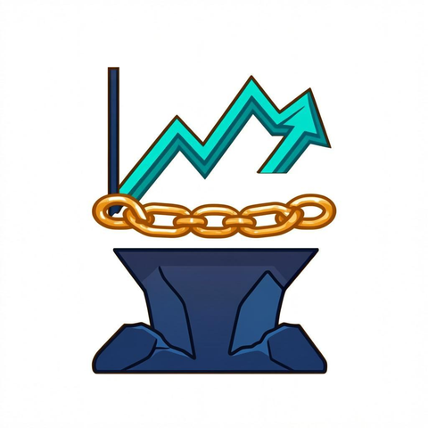

# CritMin Oracle — On-Chain Risk Oracle for Critical Minerals

<p align="center">
  
  
  
  
</p>

<p align="center">
  
</p>


## Demo

https://github.com/user-attachments/assets/demo.mp4

> _Generated with [demo-video-generator](https://github.com/zan-maker/demo-video-generator)_
> AI-Powered Critical Minerals Supply Chain Risk Oracle deployed on HashKey Chain Testnet.

## Overview

CritMin Oracle is a decentralized on-chain oracle that provides AI-computed risk scores for critical minerals (Lithium, Nickel, Cobalt). These scores are composites of:

- **Price Forecast Deviation** — AI model forecast vs. actual market prices
- **Supply Sentiment** — NLP analysis of SEC filings for supply chain signals
- **Regulatory Risk** — Keyword-based scoring from regulatory documents

DeFi protocols can consume these on-chain scores for underwriting, lending, insurance, and collateral valuation decisions.

## Architecture

```
┌──────────────────┐     ┌──────────────────┐     ┌──────────────────────┐
│   Data Sources    │     │  Python Pipeline  │     │   HashKey Chain      │
│                  │     │                  │     │   (Chain ID: 133)    │
│ FRED API ────────┼────►│  ┌────────────┐   │     │                      │
│ (PPI, IP)        │     │  │ Fetch Data  │   │     │ ┌──────────────────┐ │
│                  │     │  └─────┬──────┘   │     │ │ CritMinOracle    │ │
│ Alpha Vantage ───┼────►│  ┌─────▼──────┐   │     │ │                  │ │
│ (Li, Ni, Co)     │     │  │ Compute     │   │     │ │  Risk Scores     │ │
│                  │     │  │ Risk Scores  │   │     │ │  Price Data      │ │
│ SEC Filings ─────┼────►│  └─────┬──────┘   │     │ │  Sentiment       │ │
│ (EDGAR)          │     │  ┌─────▼──────┐   │     │ │  Reg Risk        │ │
│                  │     │  │ Push On-    │───┼────►│ │                  │ │
│ Mock Data ───────┼────►│  │ Chain       │   │     │ │  Events ◄───────┼─┼──► DeFi Protocols
│ (--demo mode)    │     │  └────────────┘   │     │ └──────────────────┘ │
└──────────────────┘     └──────────────────┘     └──────────────────────┘
```

## Smart Contract

### Key Data Structures

```solidity
struct RiskScore {
    uint256 timestamp;       // Unix timestamp
    int256 compositeScore;   // -100 to +100 (negative=risky, positive=safe)
    int256 priceDeviation;   // forecast vs actual %
    int256 supplySentiment;  // NLP from SEC filings (-1.0 to 1.0)
    int256 regulatoryRisk;   // regulatory keyword score (0-100)
    int256 forecastDirection;// 12-month forecast (positive=up)
    uint256 confidence;      // confidence interval width (bps)
}

struct MineralData {
    string symbol;           // "LITHIUM", "NICKEL", "COBALT"
    int256 currentPrice;     // USD/mt (scaled 1e8)
    int256 forecastPrice;    // 12-month forecast (scaled)
    uint256 lastUpdated;
    uint256 updateCount;
    RiskScore latestScore;
}
```

### Key Functions

| Function | Access | Description |
|----------|--------|-------------|
| `pushFullUpdate()` | Owner | Batch update price + risk score |
| `pushRiskScore()` | Owner | Update risk score only |
| `updatePrice()` | Owner | Update price data only |
| `getCompositeRiskIndex()` | Public | Get composite risk score |
| `getWeightedRiskScore()` | Public | Custom-weighted risk for DeFi |
| `getMineralData()` | Public | Full mineral snapshot |
| `getHistoricalScore()` | Public | Historical risk data |
| `isFresh()` | Public | Check data freshness |

### Events

All updates emit events for DeFi protocol integration:
- `RiskScoreUpdated` — on every risk score push
- `PriceUpdated` — on every price update
- `MineralRegistered` — on mineral initialization

## Quick Start

### Prerequisites

- [Node.js](https://nodejs.org/) >= 18
- [Python](https://python.org/) >= 3.10 (for pipeline)
- tHSK from [HashKey Faucet](https://faucet.hsk.xyz)

### 1. Install Dependencies

```bash
npm install
```

### 2. Configure Environment

```bash
cp .env.example .env
# Edit .env with your private key (from MetaMask or similar)
```

### 3. Compile Contract

```bash
npm run compile
```

### 4. Run Tests

```bash
npm run test
```

### 5. Deploy to HashKey Chain Testnet

```bash
npm run deploy
```

### 6. Run Pipeline (Demo Mode)

```bash
# No API keys needed!
python pipeline/critmin_pipeline.py --demo
```

### 7. Run Pipeline (Live Mode)

```bash
# Requires FRED_API_KEY and ALPHA_VANTAGE_KEY in .env
python pipeline/critmin_pipeline.py --live --contract 0xYourContractAddress
```

## Pipeline Details

The Python pipeline (`pipeline/critmin_pipeline.py`) implements:

### Data Fetching
- **FRED API**: Producer Price Index (PPI) for metals, Industrial Production Index
- **Alpha Vantage**: Monthly commodity prices for Lithium, Nickel, Cobalt
- **Demo Mode**: Realistic mock data when API keys are unavailable

### Risk Computation
- **Price Forecast**: Linear regression on historical prices (upgradeable to GradientBoosting/LSTM)
- **Sentiment Analysis**: VADER-style keyword-based NLP on SEC filing text
- **Regulatory Scoring**: Weighted keyword matching against 20+ regulatory terms

### Composite Score Formula
```
composite = (price_deviation × 0.30) + (sentiment × 0.35) + (regulatory_risk × 0.25) + (forecast_direction × 0.10)
```

Score range: **-100** (extremely bearish/risky) to **+100** (bullish/safe)

## DeFi Integration

DeFi protocols can consume oracle data in several ways:

### 1. Direct Contract Calls
```solidity
// Get risk score for underwriting
int256 risk = oracle.getCompositeRiskIndex(oracle.LITHIUM());

// Adjust LTV based on risk
uint256 maxLTV = risk > 0 
    ? 75_00  // 75% for safe minerals
    : 50_00; // 50% for risky minerals
```

### 2. Event Listeners
```javascript
// Watch for risk score updates
oracle.on("RiskScoreUpdated", (mineral, timestamp, score, ...args) => {
    if (score < -5000) {
        triggerRiskAlert(mineral, score);
    }
});
```

### 3. Weighted Risk for Custom Models
```solidity
// Protocol-specific risk weighting
int256 customRisk = oracle.getWeightedRiskScore(
    mineralHash,
    4000,  // 40% price weight
    3500,  // 35% sentiment weight
    2500   // 25% regulatory weight
);
```

## HashKey Chain Testnet

| Parameter | Value |
|-----------|-------|
| Network | HashKey Chain Testnet |
| Chain ID | 133 |
| Currency | tHSK |
| RPC | `https://hashkeychain-testnet.alt.technology` |
| Explorer | https://testnet-explorer.hsk.xyz |
| Faucet | https://faucet.hsk.xyz |

## Project Structure

```
critmin-oracle/
├── contracts/
│   └── CritMinOracle.sol      # Main oracle smart contract
├── scripts/
│   └── deploy.ts              # Deployment script
├── test/
│   └── CritMinOracle.test.ts  # Contract tests
├── pipeline/
│   └── critmin_pipeline.py    # Off-chain risk pipeline
├── hardhat.config.ts          # Hardhat configuration
├── tsconfig.json              # TypeScript config
├── package.json               # Node dependencies
├── requirements.txt           # Python dependencies
├── .env.example               # Environment template
├── .gitignore                 # Git ignore rules
└── README.md                  # This file
```

## License

MIT

---

## CHP Governance

This repository is hardened with the [Consensus Hardening Protocol (CHP)](https://codeberg.org/cubiczan/consensus-hardening-protocol), Cubiczan's decision-governance layer for multi-agent AI systems.

### Protocol Layers
- **R0 Gate**: All decisions must pass Solvable, Scoped, Valid, Worth_it checks
- **Foundation Disclosure**: 1-3 weakest assumptions, 1-2 invalidation conditions, 1 key vulnerability
- **Adversarial Layer**: Mandatory devil's advocate at Phase 0 and Round 3
- **State Machine**: EXPLORING → PROVISIONAL → PROVISIONAL_LOCK → LOCKED
- **Third-Party Validation**: Independent CONFIRM/REJECT before lock

### Domain Configuration
- **Category**: Blockchain / Mining
- **Foundation Threshold**: 85
- **CFO Accuracy Guard**: Disabled

### Compliance Artifacts
| File | Purpose |
|------|---------|
| `.chp/STATE_MACHINE.md` | Decision state transitions |
| `.chp/R0_CONFIG.yaml` | Domain-calibrated thresholds |
| `.chp/ADVERSARIAL_PROMPTS.md` | Standardized challenge templates |
| `.chp/CHP_COMPLIANCE.md` | Compliance tracking & audit trail |

### CHP Version
cognitive-mesh-orchestrator 0.1.0 | [Protocol Docs](https://codeberg.org/cubiczan/consensus-hardening-protocol)

